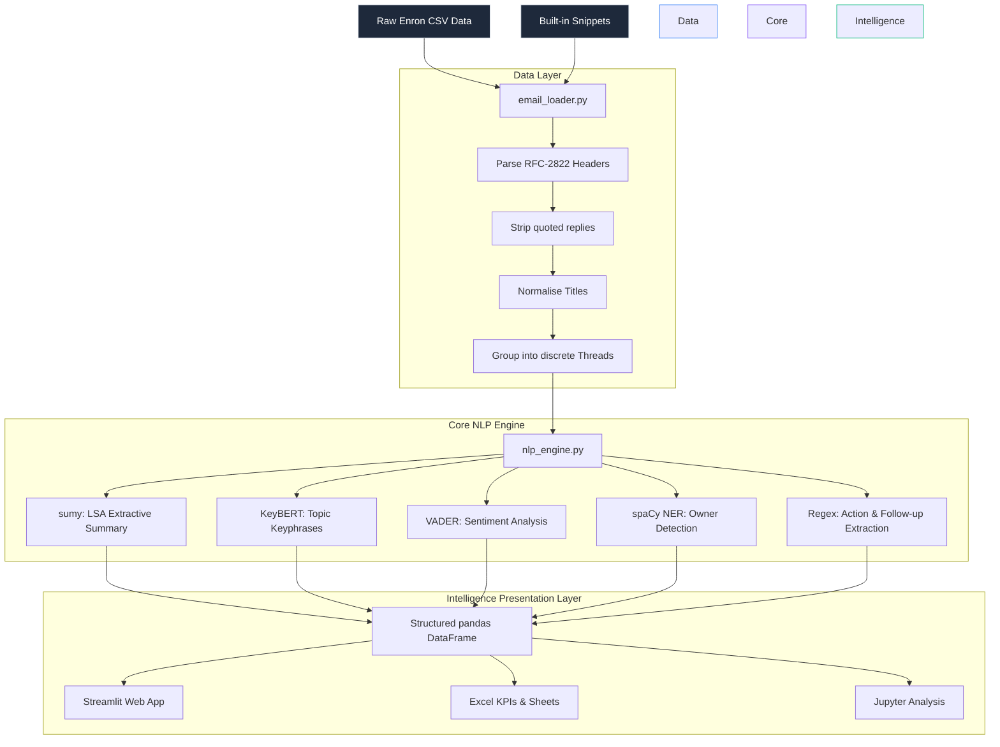

# 🏗️ System Architecture & NLP Technical Note

This document outlines the end-to-end architecture and NLP flow for the **Group Email Summarizer**. The system is built to ingest massive, unstructured email dumps and apply lightweight, locally-running Machine Learning to distil business insights.

## System Diagram

## 1. The Data Ingestion Engine
The pipeline starts by loading raw CSV data (such as the Enron Email dataset). The `email_loader.py` script:
- Converts unstructured RFC-2822 standard email bodies into structured metadata.
- Cleans the email trails by stripping "FWD:" and "RE:" tags.
- Statistically groups connected individual emails into **Threads**.

## 2. Local AI & NLP Pipeline
The `nlp_engine.py` runs 5 simultaneous tasks on every thread. Crucially, **no external APIs are used** so sensitive internal data never leaves the local machine.
1. **Extractive Summarisation**: Uses `sumy` (Latent Semantic Analysis) to generate a concise, 3-sentence summary of the main points of the thread.
2. **Topic Modelling**: Implements `KeyBERT` (sentence-transformers) to pull the highest-weighted keyword sequences, labelling the overall category of the thread.
3. **Sentiment Grading**: Applies NLTK's `VADER` sentiment heuristics to gauge if an interaction is Urgent, Negative, Neutral, or Positive based on professional compound phrasing.
4. **Ownership Allocation**: Uses `spaCy` Named Entity Recognition (NER) models (`en_core_web_sm`) to track exactly which people are mentioned in the emails to suggest highly probable "Task Owners."
5. **Pattern Detection**: Uses compiled regular expressions to scan for commands (e.g. "Please ensure...", "Action:", "Must be done") to compile an immediate list of action items.

## 3. Resilience and Fallbacks
The system is built to fail gracefully:
- If a heavy machine learning model (like `KeyBERT`) fails to load in restricted enterprise environments, the system automatically triggers a built-in `TF-IDF` statistical fallback process to ensure insights are still mapped without crashing the application.
- `Streamlit` prevents file-upload errors natively via exception catches that prompt the user clearly.
